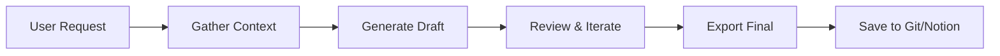

# Awesome Clawdbot [](https://awesome.re)

> A curated collection of awesome use cases, prompts, workflows, and resources for [Clawdbot](https://github.com/clawdbot/clawdbot) — your AI-powered personal assistant that connects Claude to everything.

<p align="center">
  
</p>

<p align="center">
  <a href="#use-cases">Use Cases</a> •
  <a href="#workflows">Workflows</a> •
  <a href="#prompts">Prompts</a> •
  <a href="#integrations">Integrations</a> •
  <a href="#contributing">Contributing</a>
</p>

---

## Contents

- [What is Clawdbot?](#what-is-clawdbot)
- [Use Cases](#use-cases)
  - [Legal & Compliance Documents](#legal--compliance-documents)
  - [Code Review & Development](#code-review--development)
  - [Documentation Generation](#documentation-generation)
  - [Data Analysis & Reports](#data-analysis--reports)
  - [Automation & Scheduling](#automation--scheduling)
- [Workflows](#workflows)
- [Prompts](#prompts)
- [Integrations](#integrations)
- [Tips & Best Practices](#tips--best-practices)
- [Contributing](#contributing)
- [Community](#community)
- [License](#license)

---

## What is Clawdbot?

Clawdbot is an open-source AI assistant framework that connects Claude (Anthropic's AI) to your tools, files, and services. It runs locally and supports multiple channels (Slack, Discord, Telegram, WhatsApp, Signal), integrations (GitHub, Jira, Notion), and automation capabilities.

**Key Features:**
- 🔌 Multi-channel messaging (Slack, Discord, Telegram, etc.)
- 🛠️ Tool integration (GitHub, Jira, Notion, Calendar)
- 🌐 Browser automation
- ⏰ Cron jobs and scheduled tasks
- 🧠 Persistent memory across sessions
- 🔒 Local-first, privacy-focused

📚 [Official Documentation](https://docs.clawd.bot) | 💬 [Discord Community](https://discord.com/invite/clawd)

---

## Use Cases

### Legal & Compliance Documents

Generate comprehensive, legally-sound documents tailored to your product and jurisdiction.

#### Privacy Policy Generator

Create GDPR/LGPD-compliant privacy policies that actually match your product's data practices.

**Prompt Template:**

```markdown
I need a Privacy Policy for my SaaS product with the following details:

**Product Info:**
- Name: [Your Product Name]
- Type: [SaaS/Mobile App/Web Platform]
- Industry: [Engineering Metrics/Healthcare/Finance/etc.]

**Data Collection:**
- Authentication method: [Google OAuth/Email-Password/SSO]
- User data collected: [Name, Email, Profile Photo, etc.]
- Third-party integrations: [GitHub, Jira, Linear, etc.]
- Data collected from integrations: [Commits, PRs, Issues, etc.]

**Infrastructure:**
- Hosting provider: [AWS/GCP/Azure]
- Database: [PostgreSQL/MongoDB/etc.]
- Region: [US-East/EU-West/etc.]

**Compliance Requirements:**
- Jurisdictions: [Brazil (LGPD)/EU (GDPR)/California (CCPA)]
- Role: [Data Controller/Data Processor/Both]

Please generate a comprehensive Privacy Policy that:
1. Clearly defines roles (Controller vs Processor)
2. Lists all data collected with purposes and legal bases
3. Explains data retention periods
4. Details security measures
5. Covers international data transfers
6. Includes all required rights (access, deletion, portability)
7. Provides contact information templates
```

**What You Get:**
- Complete Privacy Policy (15-20 pages)
- Data flow tables with legal bases
- Retention schedule
- Subprocessor list template
- Security measures documentation
- User rights procedures

#### Terms of Service Generator

**Prompt Template:**

```markdown
I need Terms of Service for my SaaS product:

**Product Info:**
- Name: [Your Product Name]
- Service Model: [SaaS B2B/B2C/Marketplace]
- Pricing Model: [Subscription/Usage-based/Freemium]

**Key Features to Cover:**
- [Feature 1]: [Brief description]
- [Feature 2]: [Brief description]
- Third-party integrations: [List them]

**Business Requirements:**
- Liability cap: [12 months fees / fixed amount]
- SLA target: [99.5% / 99.9%]
- Support channels: [Email/Chat/Phone]
- Jurisdiction: [São Paulo, Brazil / Delaware, USA]

**Special Clauses Needed:**
- [ ] Acceptable use policy
- [ ] API usage limits
- [ ] Data ownership clarification
- [ ] Intellectual property protection
- [ ] Indemnification clauses

Please generate comprehensive Terms of Service including all standard sections.
```

---

### Code Review & Development

Leverage Clawdbot's GitHub integration for intelligent code assistance.

#### Automated PR Review

**Setup:**
1. Connect GitHub via Clawdbot skills
2. Configure webhook or polling

**Prompt Template:**

```markdown
Review this Pull Request:
- Repository: [owner/repo]
- PR Number: [#123]

Focus on:
- [ ] Security vulnerabilities
- [ ] Performance implications
- [ ] Code style consistency
- [ ] Test coverage
- [ ] Documentation updates needed

Provide actionable feedback with code suggestions.
```

#### Architecture Decision Records (ADR)

**Prompt Template:**

```markdown
Create an Architecture Decision Record for:

**Context:**
[Describe the current situation and why a decision is needed]

**Decision Drivers:**
- [Driver 1]
- [Driver 2]

**Options Considered:**
1. [Option A]
2. [Option B]
3. [Option C]

**Constraints:**
- Timeline: [X weeks]
- Budget: [If applicable]
- Team expertise: [Relevant skills]

Generate a complete ADR following the Michael Nygard format.
```

---

### Documentation Generation

Create and maintain comprehensive documentation automatically.

#### API Documentation

**Prompt Template:**

```markdown
Generate API documentation for my REST endpoints:

**Base URL:** https://api.example.com/v1

**Authentication:** Bearer token (JWT)

**Endpoints to document:**
1. POST /users - Create user
2. GET /users/{id} - Get user by ID
3. PUT /users/{id} - Update user
4. DELETE /users/{id} - Delete user

For each endpoint, include:
- Description
- Request/Response examples
- Error codes
- Rate limits
- Code samples (curl, JavaScript, Python)

Use OpenAPI 3.0 format.
```

#### README Generator

**Prompt Template:**

```markdown
Create a README.md for my project:

**Project Info:**
- Name: [Project Name]
- Language: [Python/TypeScript/Go/etc.]
- Type: [CLI Tool/Library/Web App]
- License: [MIT/Apache-2.0/etc.]

**Key Features:**
- [Feature 1]
- [Feature 2]
- [Feature 3]

**Installation Methods:**
- npm/pip/brew/docker

**Include:**
- Badges (build status, coverage, version)
- Quick start guide
- Configuration options
- Contributing guidelines link
- Changelog link
```

---

### Data Analysis & Reports

#### Engineering Metrics Dashboard (Jira)

The simplest way to get engineering metrics. Just ask.

**Step 1:** Add your Jira credentials to `TOOLS.md`:

```markdown
## Jira

- **Instance:** https://YOUR-INSTANCE.atlassian.net
- **Email:** your-email@company.com
- **API Token:** your-api-token (get it at https://id.atlassian.com/manage-profile/security/api-tokens)
- **Project:** YOUR_PROJECT_KEY
- **Board ID:** 123
```

**Step 2:** Copy, paste, customize:

```
Connect to my Jira (credentials in TOOLS.md) and give me the engineering metrics for project [PROJECT_KEY] from the last [7/14/30] days.

Include: cycle time, lead time, throughput, bugs vs features ratio, and WIP.

Language: [English/Portuguese/Spanish]
```

That's it. Clawdbot handles the API calls, calculations, and formatting automatically.

**Example Output:**
- 📊 Cycle Time: 3.2 days (median)
- 🚀 Throughput: 12 stories/week
- 🐛 Bug ratio: 18% of completed items
- ⏱️ Lead Time: 5.1 days
- 📋 WIP: 8 items in progress

---

#### Weekly Status Report

```
Generate a weekly status report for my team.

Check:
- Jira board [BOARD_ID]: completed, in progress, blocked
- GitHub repos: [owner/repo1, owner/repo2]

Period: last 7 days
Language: [English/Portuguese]
```

---

### Automation & Scheduling

Leverage Clawdbot's cron capabilities for scheduled tasks.

#### Daily Standup Reminder

**Cron Setup:**

```yaml
# In your Clawdbot config or via cron tool
schedule: "0 9 * * 1-5"  # 9 AM, Monday-Friday
task: |
  Check Jira for my in-progress tickets and yesterday's completions.
  Send a formatted standup update to #team-standup channel:
  - What I completed yesterday
  - What I'm working on today
  - Any blockers
```

#### Inbox Zero Assistant

**Heartbeat Task:**

```markdown
# HEARTBEAT.md
- Check for urgent unread emails (last 2 hours)
- Summarize any requiring immediate attention
- Draft quick replies for simple requests
- Flag items needing deep focus time
```

---

## Workflows

### Multi-Step Document Generation



### Automated Compliance Audit

1. **Trigger**: Monthly cron job
2. **Scan**: Check all data flows against policy
3. **Report**: Generate compliance checklist
4. **Alert**: Notify team of any gaps
5. **Track**: Update compliance dashboard

---

## Prompts

### Quick Prompts Collection

| Task | Prompt |
|------|--------|
| Summarize meeting | "Summarize the key decisions and action items from [meeting notes]" |
| Code explanation | "Explain this code like I'm a junior developer: [code]" |
| Bug investigation | "Help me debug this error: [error message]. Here's the relevant code: [code]" |
| Email drafting | "Draft a professional email to [recipient] about [topic]. Tone: [formal/friendly]" |
| Commit message | "Write a conventional commit message for these changes: [diff summary]" |

---

## Integrations

### Recommended Skill Combinations

| Use Case | Skills Needed |
|----------|---------------|
| Full DevOps | GitHub + Jira + Slack |
| Documentation | Notion + GitHub |
| Personal Assistant | Calendar + Email + Weather |
| Team Management | Slack + Jira + GitHub |

### Custom Skill Development

Create your own skills following the [Skill Creator Guide](https://docs.clawd.bot/skills/creating-skills).

---

## Tips & Best Practices

### 1. Be Specific with Context

❌ "Write me a privacy policy"

✅ "Write a privacy policy for a B2B SaaS that collects user emails via Google OAuth, stores data in AWS US-East, and needs LGPD compliance"

### 2. Use Memory Effectively

- Store project context in `MEMORY.md`
- Keep daily notes in `memory/YYYY-MM-DD.md`
- Reference previous work: "Using the same format as the ToS we created..."

### 3. Leverage File Operations

```markdown
Read the existing document at ./docs/privacy.md and update it to:
1. Add a new data type we're collecting: [type]
2. Update the retention period for [category] to [X days]
3. Add [New Subprocessor] to the subprocessor list
```

### 4. Chain Complex Tasks

```markdown
Let's do this in steps:
1. First, read our current API documentation
2. Then, scan our codebase for new endpoints
3. Generate documentation for any undocumented endpoints
4. Create a PR with the updates
```

### 5. Use Structured Output

Request specific formats when needed:
- "Output as a markdown table"
- "Use JSON format for the config"
- "Create a Mermaid diagram"

---

## Contributing

We love contributions! This list is community-driven.

### How to Contribute

1. **Fork** this repository
2. **Add** your use case, prompt, or workflow
3. **Follow** the format of existing entries
4. **Submit** a Pull Request

### Contribution Guidelines

- **One item per PR** (unless closely related)
- **Include a real example** when possible (sanitized of personal data)
- **Test your prompts** with Clawdbot before submitting
- **Use English** for all contributions
- **Follow the format**:

```markdown
#### Your Use Case Title

Brief description of what this achieves.

**Prompt Template:**

\`\`\`markdown
Your prompt here with [PLACEHOLDERS] for customization
\`\`\`

**What You Get:**
- Expected output 1
- Expected output 2
```

### Ideas We're Looking For

- 🏢 Business document templates
- 🔧 DevOps automation workflows
- 📊 Data analysis prompts
- 🎨 Creative writing assistance
- 🌍 Multi-language support examples
- 🔐 Security audit checklists
- 📱 Mobile app integration patterns

### Code of Conduct

Be respectful. Be helpful. Be awesome. 

See [CODE_OF_CONDUCT.md](CODE_OF_CONDUCT.md) for details.

---

## Community

- 💬 **Discord**: [Join our community](https://discord.com/invite/clawd)
- 📖 **Docs**: [docs.clawd.bot](https://docs.clawd.bot)
- 🐙 **GitHub**: [clawdbot/clawdbot](https://github.com/clawdbot/clawdbot)
- 🌐 **Skills Hub**: [clawdhub.com](https://clawdhub.com)

---

## License

[](https://creativecommons.org/publicdomain/zero/1.0/)

This list is released into the public domain. See [LICENSE](LICENSE) for details.

---

<p align="center">
  <sub>Built with 🤖 by the Clawdbot community</sub>
</p>
