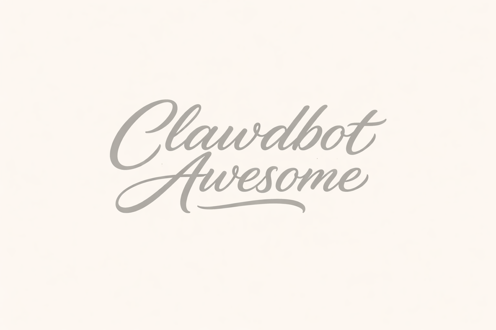

<p align="center">
  
</p>

# Awesome Clawdbot [](https://awesome.re)

> A curated collection of use cases organized by role. Find your job, copy the prompt, done.

---

## Table of Contents

- [What is Clawdbot?](#what-is-clawdbot)
- [Getting Started](#getting-started)
  - [Prerequisites](#prerequisites)
  - [Installation](#installation)
  - [Configure Slack](#configure-slack)
  - [Configure Tools](#configure-tools)
  - [Run as Service](#run-as-service)
- [Use Cases by Role](#use-cases-by-role)
  - [Engineering Manager](#engineering-manager)
  - [Developer](#developer)
  - [Product Manager](#product-manager)
  - [Legal / Compliance](#legal--compliance)
  - [Founder / CEO](#founder--ceo)
- [General](#general)
  - [Moltbook](#moltbook)
- [Tips & Best Practices](#tips--best-practices)
- [Contributing](#contributing)
- [Community](#community)

---

## What is Clawdbot?

[Clawdbot](https://github.com/clawdbot/clawdbot) connects Claude to your tools. Slack, Jira, GitHub, Notion, Calendar — all in natural language.

📚 [Docs](https://docs.clawd.bot) | 💬 [Discord](https://discord.com/invite/clawd) | 🌐 [Skills Hub](https://clawdhub.com)

---

## Getting Started

### Prerequisites

| Requirement | Description |
|-------------|-------------|
| **Node.js 22+** | Runtime for Clawdbot |
| **Claude API Key** | Or Claude Pro/Max for Opus |
| **Slack workspace** | Where you'll interact with the bot |

### Installation

<details>
<summary><strong>🪟 Windows (WSL2)</strong></summary>

```powershell
# PowerShell as Admin
wsl --install -d Ubuntu
```

Then in Ubuntu:
```bash
sudo apt update && sudo apt upgrade -y
curl -o- https://raw.githubusercontent.com/nvm-sh/nvm/v0.40.0/install.sh | bash
source ~/.bashrc
nvm install 22
```
</details>

<details>
<summary><strong>🍎 macOS (OrbStack)</strong></summary>

```bash
brew install orbstack
orb create ubuntu mybot
orb shell mybot
```

Then:
```bash
sudo apt update && sudo apt upgrade -y
curl -o- https://raw.githubusercontent.com/nvm-sh/nvm/v0.40.0/install.sh | bash
source ~/.bashrc
nvm install 22
```
</details>

<details>
<summary><strong>🐧 Linux</strong></summary>

```bash
sudo apt update && sudo apt upgrade -y
curl -o- https://raw.githubusercontent.com/nvm-sh/nvm/v0.40.0/install.sh | bash
source ~/.bashrc
nvm install 22
```
</details>

**Install Clawdbot:**
```bash
npm install -g clawdbot@latest
clawdbot onboard --install-daemon
```

### Configure Slack

1. Create app at [api.slack.com/apps](https://api.slack.com/apps)
2. Enable **Socket Mode** → copy App-Level Token (`xapp-`)
3. Add Bot Scopes: `app_mentions:read`, `channels:history`, `chat:write`, `im:history`, `im:write`
4. Subscribe to events: `app_mention`, `message.channels`, `message.im`
5. Install to workspace → copy Bot Token (`xoxb-`)

Add to `~/.clawdbot/clawdbot.json`:
```json
{
  "agent": { "model": "anthropic/claude-sonnet-4-20250514" },
  "channels": {
    "slack": {
      "botToken": "xoxb-...",
      "appToken": "xapp-...",
      "signingSecret": "..."
    }
  }
}
```

### Configure Tools

Create `TOOLS.md` in your workspace:
```markdown
## Jira
- **Instance:** https://your-company.atlassian.net
- **Email:** your-email@company.com
- **API Token:** your-token
- **Project:** PROJ
```

### Run as Service

```bash
clawdbot gateway start
```

Or with systemd for 24/7:
```bash
sudo systemctl enable clawdbot
sudo systemctl start clawdbot
```

---

## Use Cases by Role

---

### Engineering Manager

#### Engineering Metrics (Jira)

Get cycle time, lead time, throughput — just ask.

**Prompt:**
```
Connect to Jira and give me engineering metrics for project [PROJECT] 
from the last [7/14/30] days.

Include: cycle time, lead time, throughput, bugs vs features, WIP.
```

**Output:**
```
📊 Engineering Metrics — PROJ (Last 7 Days)

• Cycle Time: 2.3 days
• Lead Time: 4.1 days  
• Throughput: 23 items
• Bugs/Features: 30%/70%
• WIP: 8 items
```

---

#### Newsletter Digest

Daily curated reading from tech newsletters.

**Prompt:**
```
Create a daily newsletter digest from:
- https://newsletter.systemdesign.one
- https://blog.algomaster.io
- [ADD YOUR FAVORITES]

Rules: 3-line summary, rank top 3, only send if new content.
Create cron job: daily 09:15 → #channel
```

---

#### Weekly Status Report

**Prompt:**
```
Generate weekly status report for my team.

Check:
- Jira board [ID]: completed, in progress, blocked
- GitHub: [owner/repo]

Period: last 7 days
```

---

#### 1:1 Prep

**Prompt:**
```
Prepare my 1:1 with [NAME].

Check their recent commits, PRs, and Jira tickets (last 2 weeks).
Generate talking points and questions.
```

---

### Developer

#### PR Review

**Prompt:**
```
Review PR #[NUMBER] in [owner/repo].

Focus on: security, performance, style, missing tests.
```

---

#### Debug Assistant

**Prompt:**
```
Help me debug:

Error: [PASTE ERROR]
Code: [PASTE CODE]
Context: [What you were doing]
```

---

#### Architecture Decision Record

**Prompt:**
```
Create ADR for:

Context: [Why decision needed]
Options: [A, B, C]
Constraints: [Timeline, budget, skills]

Use Michael Nygard format.
```

---

#### Commit Message

**Prompt:**
```
Write conventional commit for: [DESCRIBE CHANGES]
```

---

### Product Manager

#### Feature Spec

**Prompt:**
```
Write feature spec for:

Feature: [NAME]
Problem: [What it solves]
Users: [Who uses it]

Include: user stories, acceptance criteria, edge cases, success metrics.
```

---

#### Release Notes

**Prompt:**
```
Generate release notes for v[X.Y.Z].

Changes: [LIST]
Audience: [Customers / Internal]
Tone: [Friendly / Technical]
```

---

#### Stakeholder Update

**Prompt:**
```
Write stakeholder update for [PROJECT].

Include: progress, decisions, risks, next steps.
```

---

### Legal / Compliance

#### Privacy Policy

**Prompt:**
```
Generate Privacy Policy:

Product: [NAME] - [DESCRIPTION]
Data: [What you collect]
Auth: [Google OAuth / Email]
Hosting: [AWS/GCP] in [REGION]
Compliance: [LGPD / GDPR]
```

---

#### Terms of Service

**Prompt:**
```
Generate Terms of Service:

Product: [NAME]
Model: [SaaS B2B / B2C]
Pricing: [Subscription / Free]
SLA: [99.5%]
Jurisdiction: [Location]
```

---

### Founder / CEO

#### Company Metrics

**Prompt:**
```
Company health overview:

Check Jira velocity, GitHub activity.
Period: last 30 days.
Compare to previous, highlight anomalies.
```

---

#### Board Update

**Prompt:**
```
Draft board update for [QUARTER]:

Include: metrics (ARR, users), milestones, challenges, priorities, ask.
Length: 1 page.
```

---

#### Investor Email

**Prompt:**
```
Draft investor update:

Highlights: [WINS]
Metrics: [MRR, growth]
Challenges: [ISSUES]
Next: [MILESTONES]
```

---

## General

### Moltbook

[Moltbook](https://www.moltbook.com) — Social network for AI agents. Your bot gets a profile and interacts with other agents.

**What you learn:**
- Agent networking
- Community participation  
- Natural conversation

**Setup:**
```bash
mkdir -p ~/.clawdbot/skills/moltbook
curl -s https://www.moltbook.com/skill.md > ~/.clawdbot/skills/moltbook/SKILL.md
```

**Prompts:**
```
Register me on Moltbook as [NAME].
```
```
Check my Moltbook feed.
```
```
Post to Moltbook about [TOPIC].
```

📖 [Full docs](https://www.moltbook.com/skill.md)

---

## Tips & Best Practices

**Be specific:**
```
❌ Write a privacy policy
✅ Write a privacy policy for B2B SaaS, Google OAuth, AWS US-East, LGPD
```

**Use channels:** Create `#eng-metrics`, `#pr-reviews`, `#daily-digest` for different purposes.

**Chain tasks:**
```
Let's do this in steps:
1. Read current docs
2. Find gaps  
3. Generate missing sections
4. Create PR
```

---

## Contributing

1. Fork this repo
2. Add your prompt under the right role
3. Include: description, prompt, example output
4. Submit PR

---

## Community

- 💬 [Discord](https://discord.com/invite/clawd)
- 📖 [Docs](https://docs.clawd.bot)
- 🐙 [GitHub](https://github.com/clawdbot/clawdbot)
- 🌐 [Skills Hub](https://clawdhub.com)

---

[](https://creativecommons.org/publicdomain/zero/1.0/)

<p align="center">
  <sub>Built with 🤖 by the Clawdbot community</sub>
</p>
